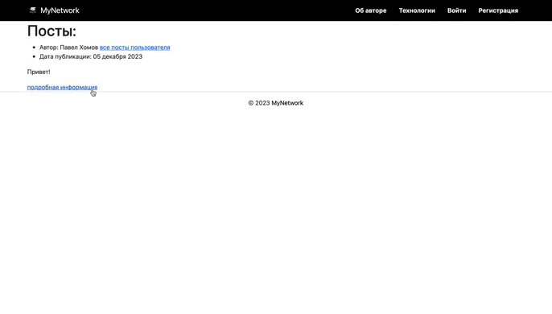

### Описание проекта:



Репозиторий содержит завершенный проект социальной сети, который позволяет пользователям вести свой блог и создавать заметки с возможностью добавления картинок. Реализована функциональность подписки на авторов и оставления комментариев для зарегистрированных пользователей. Для разработки использованы Python, Django и Templates. Проект отличается хорошо структурированным кодом, соблюдением лучших практик и безопасностью.
### Технологии

Python, Django, Templates, Docker

### Как запустить проект в Docker:

```
docker build -t my-django-app .
```

```
docker run -it --rm -p 8000:8000 my-django-app
```

Проект будет доступен по адресу <b>127.0.0.1:8000</b>

### Как запустить проект:

Создать .env файл в корне проекта:

```
SECRET_KEY=ваш_ключ
```

Клонировать репозиторий и перейти в него в командной строке:

```
git clone git@github.com:PavelHomov/Social-network-on-Django.git
cd Social-network-on-Django/
```

Cоздать и активировать виртуальное окружение:

```
python3 -m venv venv
```

```
source venv/scripts/activate
```

Установить зависимости из файла requirements.txt:

```
python3 -m pip install --upgrade pip
```

```
pip3 install -r requirements.txt
```

Выполнить миграции:

```
python3 manage.py makemigrations
```

```
python3 manage.py migrate
```

Запустить проект:

```
python3 manage.py runserver
```
